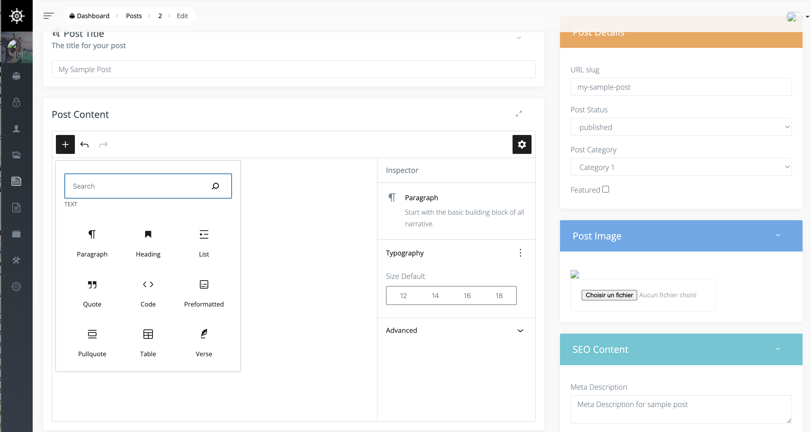

### About Voyagerberg

-   Composer install
-   copy .env.example .env => edit with your DB

-   php artisan key:generate
-   php artisan voyager:install --with-dummy
-   php artisan:serve (or valet link and use valet url)
-   Go to http://localhost:8000/admin
-   Login
-   In BREADS choose posts and add gutenberg field to body field

yours posts habe a full gutenberg editor in the body !

